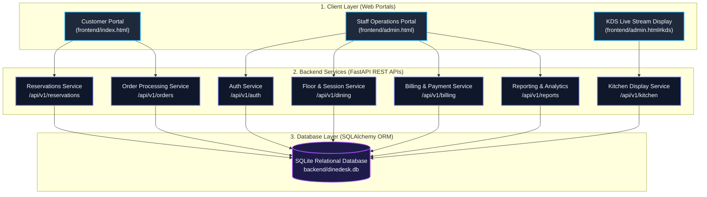
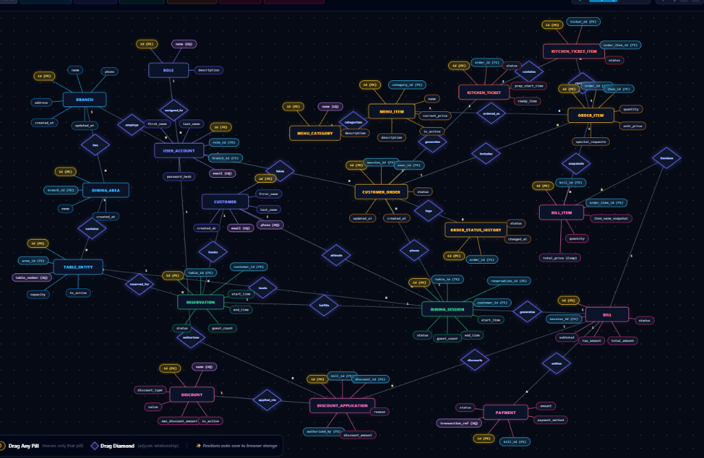

# DineDesk - Restaurant Operations and Dining Platform

DineDesk is a full-stack restaurant operations and dining floor management system built to streamline guest reservations, table seating, digital order processing, kitchen display synchronization, and billing settlements.

---

## Table of Contents

- [Overview](#overview)
- [Key Features](#key-features)
- [System Architecture](#system-architecture)
- [Technology Stack](#technology-stack)
- [Database Schema](#database-schema)
- [Project Directory Structure](#project-directory-structure)
- [Installation and Setup](#installation-and-setup)
- [Running the Application](#running-the-application)
- [Database Utilities and Inspection](#database-utilities-and-inspection)
- [REST API Reference](#rest-api-reference)
- [License](#license)

---

## Overview

DineDesk bridges front-of-house restaurant operations and back-of-house kitchen workflows into a single unified platform. It supports both advance table reservations and walk-in guest management, real-time ticket streaming to kitchen prep stations, live order tracking, and invoice calculation.

---

## Key Features

### 1. Floor Plan and Dining Management
- Table layout monitoring categorized by dining zones (Romantic Terrace Rooftop, Main Dining Hall, Family and Kids Lounge, Chef Private Suite).
- Live occupancy indicators (Available, Occupied, Reserved).
- Dedicated seating workflows for reserved bookings and spontaneous walk-in parties.

### 2. Table Reservations
- Booking ledger capturing guest contact details, party size, table allocation, time slots, and special dining notes.
- Direct floor transition: seat confirmed reservations directly into active dining sessions.

### 3. Digital Ordering
- Categorized food catalog (Appetizers, Mains, Pizzas and Pastas, Beverages, Desserts).
- Detailed chef instructions and special requests per order item.
- Automated order total calculation and order status progression.

### 4. Kitchen Display System (KDS)
- Live order queue stream categorized by status (Pending, In Progress, Ready for Server Pickup).
- Itemized dish breakdown showing quantities, preparation statuses, and chef notes.
- One-click workflow triggers to transition tickets through cooking phases.

### 5. Billing and Cashier Settlement
- Automated invoice generation from dining session orders.
- Subtotal, taxes, and coupon application support.
- Settlement recording across payment methods (Cash, Card, UPI).

### 6. Reports and Business Analytics
- Floor metrics: total seated guests, average dining duration, active table occupancy rate.
- Revenue breakdown and category performance statistics.

---

## System Architecture

The application adopts a modular client-server architecture:



### End-to-End Operational Lifecycle

The flowchart below details the step-by-step operational lifecycle of a dining session from table seating to cashier settlement:

```mermaid
graph TD
    classDef step fill:#1e293b,stroke:#818cf8,stroke-width:1.5px,color:#f8fafc;
    classDef db fill:#0f172a,stroke:#38bdf8,stroke-width:1.5px,color:#f8fafc;
    classDef success fill:#064e3b,stroke:#34d399,stroke-width:1.5px,color:#f8fafc;

    subgraph Phase1["Phase 1: Seating and Table Allocation"]
        S1["1. Guest selects table or arrives for reservation"]:::step
        S2["2. Dispatch API: POST /api/v1/dining/sessions"]:::step
        S3[("3. Dining Session created in Database<br/>Table status locked to OCCUPIED")]:::db
        S1 --> S2 --> S3
    end

    subgraph Phase2["Phase 2: Digital Menu & Order Placement"]
        S4["4. Guest browses menu items & adds chef notes"]:::step
        S5["5. Dispatch API: POST /api/v1/orders"]:::step
        S6[("6. Order and line items saved<br/>Kitchen Ticket generated: PENDING")]:::db
        S3 --> S4 --> S5 --> S6
    end

    subgraph Phase3["Phase 3: Kitchen Preparation (KDS)"]
        S7["7. Chef starts cooking: POST /kitchen/tickets/{id}/start"]:::step
        S8[("8. Ticket status updated to IN_PROGRESS")]:::db
        S9["9. Chef completes preparation: POST /kitchen/tickets/{id}/ready"]:::step
        S10[("10. Ticket status updated to READY<br/>Server delivers food to table")]:::db
        S6 --> S7 --> S8 --> S9 --> S10
    end

    subgraph Phase4["Phase 4: Invoice Billing & Settlement"]
        S11["11. Guest requests final bill"]:::step
        S12["12. Cashier settles invoice: POST /api/v1/billing/{id}/pay"]:::step
        S13[("13. Bill status updated to PAID<br/>Table status released to AVAILABLE")]:::success
        S10 --> S11 --> S12 --> S13
    end
```



---

## Technology Stack

### Backend
- Language: Python 3.10+
- Framework: FastAPI
- Server: Uvicorn ASGI
- ORM: SQLAlchemy 2.0
- Validation: Pydantic v2
- Database: SQLite 3

### Frontend
- Architecture: Vanilla HTML5, CSS3, ES6+ JavaScript
- Asynchronous Data Fetching: Fetch API
- UI Design: Custom responsive layout, dark theme, modal systems

---

## Database Schema

The relational database is normalized to Third Normal Form (3NF) to eliminate redundancy and maintain integrity:

### Core Relations
- `branch`: Restaurant branch definitions.
- `dining_area`: Seating zones (Rooftop, Main Hall, Lounge, Private Dining).
- `table_entity`: Physical floor tables, capacity limits, and statuses.
- `customer`: Guest profiles, telephone contact numbers, and emails.
- `reservation`: Table bookings linked to customers, time slots, and seat allocations.
- `dining_session`: Active table dining sessions on the restaurant floor.
- `menu_category`: Food and beverage groupings.
- `menu_item`: Dish details, pricing, preparation timings, and dietary flags.
- `customer_order`: Orders placed during an active dining session.
- `order_item`: Line items associated with an order, quantities, and chef notes.
- `kitchen_ticket`: Kitchen preparation tickets synchronized with orders.
- `kitchen_ticket_item`: Individual dish tracking for kitchen stations.
- `bill`: Financial invoices computed per dining session.
- `payment`: Monetary transaction receipts and payment instruments.
- `user_account`: System operator accounts and role associations.

### Entity Relationship Model



An interactive, draggable version of this diagram with custom cluster highlights is also available at:
- [DineDesk Chen-Style ER Diagram](dinedesk_chen_er_diagram.html)

---

## Project Directory Structure

```
DineDesk/
|-- backend/
|   |-- alembic/                     # Database migration revisions
|   |-- app/
|   |   |-- api/v1/                  # REST API route handlers
|   |   |   |-- auth.py              # Authentication endpoints
|   |   |   |-- billing.py           # Billing and settlement routes
|   |   |   |-- dining.py            # Floor dining session routes
|   |   |   |-- kitchen.py           # Kitchen Display System routes
|   |   |   |-- menu.py              # Menu catalog management
|   |   |   |-- orders.py            # Order placement and tracking
|   |   |   |-- reports.py           # Analytics and daily summary
|   |   |   |-- reservations.py      # Table reservation workflows
|   |   |   `-- restaurant.py        # Table and area configuration
|   |   |-- core/                    # App configuration and database setup
|   |   |-- models/                  # SQLAlchemy ORM entity definitions
|   |   |-- schemas/                 # Pydantic data validation schemas
|   |   |-- services/                # Business logic implementation
|   |   `-- main.py                  # FastAPI application entry point
|   |-- tests/                       # Automated test suite
|   |-- seed_data.py                 # Initial database seeding script
|   |-- sql_shell.py                 # Interactive SQLite CLI terminal
|   |-- view_tables.py               # Database inspection and reporting utility
|   `-- requirements.txt             # Python backend dependencies
|-- database/
|   |-- seed/                        # SQL seed files
|   `-- reports.sql                  # Analytical SQL queries
|-- frontend/
|   |-- admin.html                   # Staff operations and admin dashboard
|   |-- index.html                   # Customer-facing reservation and ordering portal
|   |-- user.html                    # Customer dining interface
|   |-- app.js                       # Customer application JavaScript logic
|   |-- staff.js                     # Staff portal operational logic
|   |-- styles.css                   # Customer interface stylesheets
|   `-- staff.css                    # Admin and KDS stylesheets
|-- run_schema_demo.py               # Standalone DDL/DML presentation demonstration
|-- sql_shell.py                     # Root launcher for database queries
|-- sqlite3.bat                      # Windows CLI shortcut for SQLite shell
`-- README.md                        # Documentation
```

---

## Installation and Setup

### Prerequisites
- Python 3.10 or higher
- Git

### 1. Clone the Repository
```bash
git clone https://github.com/sahajasakhunala/DineDesk.git
cd DineDesk
```

### 2. Set Up Python Virtual Environment
On Windows:
```cmd
cd backend
python -m venv venv
.\venv\Scripts\activate
```

On Linux/macOS:
```bash
cd backend
python3 -m venv venv
source venv/bin/activate
```

### 3. Install Dependencies
```bash
pip install -r requirements.txt
```

### 4. Initialize and Seed the Database
```bash
python seed_data.py
```

---

## Running the Application

### 1. Start the Backend API Server
From the `backend` directory with the virtual environment activated:
```cmd
uvicorn app.main:app --host 127.0.0.1 --port 8000 --reload
```
The API server starts at `http://127.0.0.1:8000`.
Swagger interactive documentation is available at `http://127.0.0.1:8000/docs`.

### 2. Launch the Web Interface
Serve the `frontend` folder using any local static web server.

Using Python HTTP server:
```cmd
python -m http.server 3000 --directory ../frontend
```

Using Node.js npx serve:
```cmd
npx serve ../frontend -p 3000
```

- Customer Interface: Open `http://localhost:3000/index.html` in a web browser.
- Staff & Operations Portal: Open `http://localhost:3000/admin.html` in a web browser.

---

## Database Utilities and Inspection

DineDesk provides built-in tools to inspect and query the SQLite database without requiring third-party database clients.

### 1. Formatted Full Database Report
Prints a structured summary of tables, reservations, active sessions, kitchen orders, and bills:
```cmd
python backend/view_tables.py
```

### 2. Run a Custom SQL Query
Execute an ad-hoc SQL query directly from the terminal:
```cmd
python backend/view_tables.py "SELECT table_number, capacity FROM table_entity"
```

### 3. Interactive SQL Shell
Open an interactive SQLite session with multi-line query support and tabular formatting:
```cmd
python backend/sql_shell.py
```

Available shell commands:
- `.tables` : Lists all tables in the database.
- `.schema [table_name]` : Shows the table definition.
- `.quit` or `.exit` : Exits the shell.

---

## REST API Reference

| Method | Endpoint | Description |
|---|---|---|
| GET | `/api/v1/restaurant/tables` | Retrieve floor tables with occupancy status |
| POST | `/api/v1/reservations` | Create a new table reservation |
| GET | `/api/v1/reservations` | List reservations with status filters |
| POST | `/api/v1/dining/sessions` | Seat guests and start a dining session |
| GET | `/api/v1/dining/sessions` | List active dining sessions on floor |
| POST | `/api/v1/orders` | Place food orders for a dining session |
| GET | `/api/v1/orders/session/{id}` | Retrieve orders for a specific session |
| GET | `/api/v1/kitchen/tickets` | Live stream kitchen display tickets |
| POST | `/api/v1/kitchen/tickets/{id}/start` | Transition kitchen ticket to In Progress |
| POST | `/api/v1/kitchen/tickets/{id}/ready` | Mark ticket items ready for pickup |
| GET | `/api/v1/billing/session/{id}` | Generate invoice bill for table session |
| POST | `/api/v1/billing/{id}/pay` | Settle payment for an invoice |
| GET | `/api/v1/reports/dashboard-summary` | Retrieve key operational performance metrics |

---

## License

This project is licensed under the MIT License.
