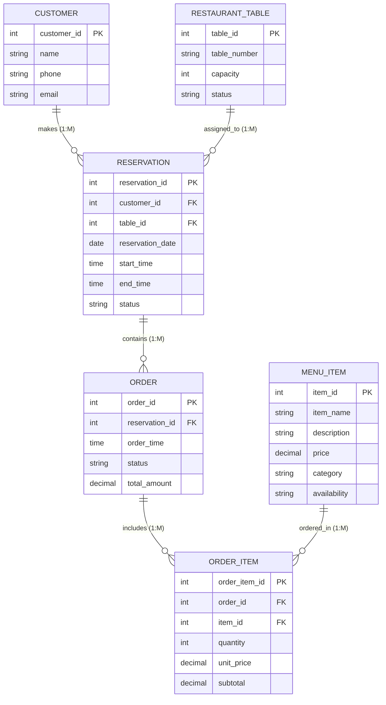

# Database Design Presentation
## Restaurant Table Reservation and Food Service Management System

---

### Slide 1: CONCEPTUAL DESIGN – ER DIAGRAM

#### Conceptual Entity-Relationship (ER) Diagram
The conceptual ER diagram illustrates the six core entities of the system and their structural relationships using standard ERD crow's foot notation.



---

### Slide 2: ERD – ENTITIES & RELATIONSHIPS

#### Core Entities & Business Rules
1. **CUSTOMER**: Represents dining clients registered in the system.
   - Primary Key: `customer_id`
   - Attributes: `name`, `phone`, `email`
   - Business Rule: A single customer can make multiple reservations over time ($1 : M$).

2. **RESTAURANT_TABLE**: Represents physical tables available in the restaurant.
   - Primary Key: `table_id`
   - Attributes: `table_number`, `capacity`, `status`
   - Business Rule: A table can host multiple reservations across different time slots ($1 : M$).

3. **RESERVATION**: Connects customers to tables for scheduled dining sessions.
   - Primary Key: `reservation_id`
   - Foreign Keys: `customer_id`, `table_id`
   - Attributes: `reservation_date`, `start_time`, `end_time`, `status`
   - Business Rule: Each reservation belongs to exactly one customer and one table.

4. **MENU_ITEM**: Represents food and beverage offerings.
   - Primary Key: `item_id`
   - Attributes: `item_name`, `description`, `price`, `category`, `availability`
   - Business Rule: A menu item can be selected across multiple order line items ($1 : M$).

5. **ORDER**: Captures a dining session's food service transaction.
   - Primary Key: `order_id`
   - Foreign Key: `reservation_id`
   - Attributes: `order_time`, `status`, `total_amount`
   - Business Rule: A reservation session can contain one or more orders ($1 : M$).

6. **ORDER_ITEM**: Represents line items belonging to a specific food order.
   - Primary Key: `order_item_id`
   - Foreign Keys: `order_id`, `item_id`
   - Attributes: `quantity`, `unit_price`, `subtotal`
   - Business Rule: Connects `ORDER` ($1 : M$) and `MENU_ITEM` ($1 : M$).

---

### Slide 3: RELATIONAL DATABASE DESIGN

#### Derivation of Relational Schema
The conceptual ERD maps directly into six normalized relational database tables ($3\text{NF}$).

1. **CUSTOMER** (
   `customer_id` **PK**, 
   `name`, 
   `phone`, 
   `email`
)

2. **RESTAURANT_TABLE** (
   `table_id` **PK**, 
   `table_number`, 
   `capacity`, 
   `status`
)

3. **RESERVATION** (
   `reservation_id` **PK**, 
   `customer_id` **FK** → `CUSTOMER(customer_id)`, 
   `table_id` **FK** → `RESTAURANT_TABLE(table_id)`, 
   `reservation_date`, 
   `start_time`, 
   `end_time`, 
   `status`
)

4. **MENU_ITEM** (
   `item_id` **PK**, 
   `item_name`, 
   `description`, 
   `price`, 
   `category`, 
   `availability`
)

5. **ORDER** (
   `order_id` **PK**, 
   `reservation_id` **FK** → `RESERVATION(reservation_id)`, 
   `order_time`, 
   `status`, 
   `total_amount`
)

6. **ORDER_ITEM** (
   `order_item_id` **PK**, 
   `order_id` **FK** → `ORDER(order_id)`, 
   `item_id` **FK** → `MENU_ITEM(item_id)`, 
   `quantity`, 
   `unit_price`, 
   `subtotal`
)

---

### Slide 4: FILLED-IN DATABASE TABLES – PART 1

#### Populated Entities: Master & Reservation Tables

##### CUSTOMER
| customer_id (PK) | name | phone | email |
|---|---|---|---|
| **1** | Rahul | 9876543210 | rahul@gmail.com |
| **2** | Ananya | 9123456780 | ananya@gmail.com |
| **3** | Karthik | 9988776655 | karthik@gmail.com |

##### RESTAURANT_TABLE
| table_id (PK) | table_number | capacity | status |
|---|---|---|---|
| **1** | T01 | 2 | Available |
| **2** | T02 | 4 | Reserved |
| **3** | T03 | 6 | Available |

##### RESERVATION
| reservation_id (PK) | customer_id (FK) | table_id (FK) | reservation_date | start_time | end_time | status |
|---|---|---|---|---|---|---|
| **101** | 1 | 2 | 2026-09-16 | 19:00 | 20:30 | Confirmed |
| **102** | 2 | 1 | 2026-09-16 | 20:00 | 21:00 | Confirmed |

---

### Slide 5: FILLED-IN DATABASE TABLES – PART 2

#### Populated Entities: Menu, Order & Order Item Tables

##### MENU_ITEM
| item_id (PK) | item_name | description | price | category | availability |
|---|---|---|---|---|---|
| **1** | Margherita Pizza | Fresh basil, mozzarella & tomato sauce | 300 | Main | Available |
| **2** | Pasta | Creamy Alfredo Fettuccine | 250 | Main | Available |
| **3** | Brownie | Warm chocolate fudge brownie | 150 | Dessert | Available |

##### ORDER
| order_id (PK) | reservation_id (FK) | order_time | status | total_amount |
|---|---|---|---|---|
| **501** | 101 | 19:15 | Completed | 550 |
| **502** | 102 | 20:10 | Preparing | 450 |

##### ORDER_ITEM
| order_item_id (PK) | order_id (FK) | item_id (FK) | quantity | unit_price | subtotal |
|---|---|---|---|---|---|
| **1** | 501 | 1 | 1 | 300 | 300 |
| **2** | 501 | 3 | 1 | 150 | 150 |
| **3** | 502 | 2 | 1 | 250 | 250 |

---

### Slide 6: DATABASE RELATIONSHIPS & REFERENTIAL INTEGRITY

#### Foreign Key Mapping & Referential Integrity Rules

```
CUSTOMER (customer_id = 1) ───< RESERVATION (customer_id = 1, reservation_id = 101)
                                      │
RESTAURANT_TABLE (table_id = 2) ──────┘ (table_id = 2)
                                      │
                                      └───< ORDER (reservation_id = 101, order_id = 501)
                                                 │
                                                 ├───< ORDER_ITEM (order_id = 501, item_id = 1) >── MENU_ITEM (item_id = 1)
                                                 └───< ORDER_ITEM (order_id = 501, item_id = 3) >── MENU_ITEM (item_id = 3)
```

#### Key Referential Integrity Rules:
1. **`RESERVATION.customer_id → CUSTOMER.customer_id`**: Guarantees that every reservation links to a valid registered customer.
2. **`RESERVATION.table_id → RESTAURANT_TABLE.table_id`**: Ensures table assignments reference existing active physical tables.
3. **`ORDER.reservation_id → RESERVATION.reservation_id`**: Prevents orphaned food orders without an active dining session/reservation.
4. **`ORDER_ITEM.order_id → ORDER.order_id`**: Binds every line item to a verified customer order.
5. **`ORDER_ITEM.item_id → MENU_ITEM.item_id`**: Guarantees prices and item titles originate from the active menu catalog.
